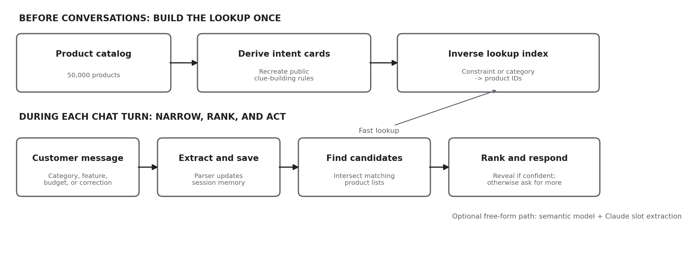

# Shopping Copilot: Inverse Intent-Card Retrieval

**Written project description — TikTok TechJam 2026, Track 4 (Deliverable 4.5.1, for Devpost).**

Repository and demo-video links are submitted separately on Devpost. See
[DEMO_VIDEO.md](DEMO_VIDEO.md) for the video plan.

> **Status of the numbers in §7.** The reported scores were measured before the
> robustness pass recorded in `DEVLOG.md` §7. That pass is score-neutral-to-positive
> on synthetic replays, but the figures below must be re-measured with one final
> `python3 -m evaluator.local_evaluator` run on the real catalog before this
> description is pasted into Devpost or quoted in the video.

---

Shopping Copilot is a conversational search system for TikTok TechJam 2026, Track 4. It
searches a frozen catalog of 50,000 clothing, shoe, and jewelry products and identifies
one hidden target product through a short conversation. It asks useful follow-up
questions, remembers the shopper's current preferences, and improves its ranking as new
clues arrive.

In one sentence: the project turns each customer clue into a precise catalog lookup, then
combines those lookups to narrow 50,000 products down to the strongest ten candidates.

## 1. Problem and competition setting

The evaluator runs simulated shopping conversations rather than real customer chats. For
each session it secretly chooses one product from the catalog. A software-generated
customer then reveals information about that product over as many as ten turns. On every
turn the agent may ask a question, return a ranked recommendation list, or both. A session
succeeds when the hidden product's parent ASIN appears among the first ten valid
recommendations.

- **Parent ASIN** — Amazon's identifier for a parent product, grouping variants under one
  catalog item. The evaluator compares it exactly, so an almost-correct product does not count.
- **Turn** — one exchange: the customer sends a message, the agent responds.
- **Ranked list** — an ordered list from the agent's best guess to its tenth-best. Rank 1 is
  worth more than rank 10.

### How success is measured

| Metric | Plain-language meaning | Score weight |
|---|---|---|
| Hit Rate@10 | Percentage of sessions where the correct product appears anywhere in the top 10. | 50% |
| MRR | Rewards placing the correct product near the top. A rank-1 hit earns more credit than a rank-10 hit. | 30% |
| MTTC-based efficiency | Rewards finding the target in fewer turns; efficiency is `clip((11 − MTTC) / 10, 0, 1)`. A miss counts as turn 11. | 20% |

The technical score combines these three measurements. It is an objective input to the
judges' Technical Execution assessment, not the entire competition score — innovation,
impact, feasibility, and presentation also matter.

## 2. Core insight: reconstruct the hidden intent card

The public evaluation protocol builds each simulated customer's clues from an **intent
card**: a small structured description of the target product containing items such as
category, material, color, feature text, and an approximate budget. Many of these clues come
directly from the product's own catalog entry.

The project reverses that process. Before any conversation begins, we apply the same public
clue-building rules to every product, then build a lookup table from each possible clue to
the products that could have produced it. During a chat, every newly revealed clue becomes a
key into that table. Hence *inverse intent-card retrieval*.

- **Intent** — what the shopper currently wants, expressed as active preferences and requirements.
- **Constraint** — a clue that narrows the search: `leather`, `brown`, `waterproof`, `budget around $75`.
- **Inverse lookup** — a table organized as *clue → matching products* instead of *product → clues*,
  like the index at the back of a textbook.

## 3. System architecture



*Figure 1. The system prepares a fast lookup before conversations, then uses it on every chat turn.*

### 3.1 Offline preparation: build once

1. Read the frozen catalog of 50,000 products.
2. Derive the possible intent-card phrases for each product using the public protocol rules
   (`starter/card_spec.py`, a vendored copy kept in parity with the evaluator by
   `tests/test_card_spec_parity.py`).
3. Invert that information into two main maps: *constraint phrase → product IDs* and
   *leaf category → product IDs*.
4. Weight phrases using IDF so rare, highly specific clues matter more than common words.

- **Offline** — work completed before the conversation starts. It may take a few seconds
  because it is done once and reused.
- **IDF** — a measure of how rare a word or phrase is across the catalog.
- **Leaf category** — the most specific category at the end of a category path, e.g.
  "Women's Hiking Boots" rather than the broad "Shoes".

### 3.2 Runtime: repeat on every turn

1. **Extract** — a deterministic parser recognizes the evaluator's fixed sentence patterns
   and pulls out the useful clues. A disclosure is re-segmented against the known key set
   rather than split naively on `"; "`, because a single constraint can contain that
   separator itself ("Imported; rubber sole").
2. **Bank** — save those clues in the session's memory.
3. **Retrieve** — look up the product list for each clue and keep the products appearing in
   all relevant lists.
4. **Rank** — score the survivors by constraint coverage, category agreement, budget
   closeness, profile tags, and weak popularity signals.
5. **Act** — reveal the top 10 when the leader is reliable, or ask for another clue when
   more information would improve the ranking.
6. **Eliminate** — a slate that fails to end the session proves those ten products are not
   the target, so they are retired and the next turn shows ten fresh candidates. Ten turns
   therefore examine up to a hundred products instead of re-showing one frozen list.

- **Deterministic parser** — predictable code recognizing known sentence patterns; the same
  input always produces the same extracted clues.
- **Session state** — short-term memory for one conversation: banked constraints,
  no-preference locks, and any intent override.
- **Intersection** — keeping only items shared by several lists. If one list holds leather
  products and another holds waterproof products, their intersection holds products that are both.

### 3.3 Ranking and confidence-gated reveal

A product scores higher when it satisfies more strong constraints. Category and exact
feature phrases carry meaningful weight. Budget is a soft preference band rather than an
exact filter, because catalog prices may be missing or approximate. Rating count and the
anonymous preference profile act only as weak tie-breakers, applied before the rerank pool
is cut so the popularity prior always gets a vote.

The confidence gate manages a trade-off. Recommending too early may place the correct item
low in the list, which hurts the 30%-weighted MRR because the evaluator locks the target's
rank at the first turn it appears. Waiting too long increases MTTC, which costs the
20%-weighted efficiency term. The agent therefore reveals when the leader is decisive, when
the intent card is drained, or when a safety turn is reached — and the gate is hard-capped at
two consecutive silent turns (`MAX_WITHHOLD_TURNS = 2` in `starter/agent.py`).

- **Soft preference** — a factor that changes the score but never removes a product.
- **Tie-breaker** — an extra rule used when two products have nearly equal main scores.
- **Confidence gate** — a rule that withholds an uncertain list until there is enough
  evidence, while preventing the conversation from stalling.

## 4. Conversation state and the four scenarios

Shares below are the exact composition of the 200 public development sessions.

| Scenario | Share | What happens | Required system behavior |
|---|---|---|---|
| Buying | 40% (80) | A strong requirement appears early. | Save it immediately and rank on the hard evidence. |
| Browsing | 40% (80) | The customer begins with a vague request. | Ask a useful question and narrow the candidate pool. |
| Intent override | 15% (30) | The customer changes an earlier preference. | Replace the old value; never search for contradictory old and new requirements together. |
| Boundary | 5% (10) | The customer says an attribute does not matter. | Lock that attribute as "no preference" and never ask about it again. |

Example of an override: when the customer changes from black running shoes to white casual
sneakers, the active color becomes white and the active style becomes casual. Appending both
sets would create a contradiction and damage retrieval. Which constraints actually conflict is
decided by the catalog — a banked constraint is dropped only when no single product card holds
both values — not by assuming a conflict.

- **Structured slot** — a named place in memory for one preference type, e.g. `color = white`.
- **Override** — a correction that replaces an older preference, because the newest stated intent is the active one.
- **No-preference lock** — a remembered decision that the customer does not care about an
  attribute, preventing repeated or invented questions.

## 5. Free-form language and the optional AI layer

The official scored protocol is handled entirely by the deterministic engine, with **no
network and zero LLM calls**. Three additional channels handle open-ended language in the
interactive demo, tried in order, so no single component is a point of failure:

- **Verbatim key recovery** (`IntentIndex.recover_keys`) — a paraphrase usually rewrites the
  sentence frame but keeps the product's own wording, so the exact index key is often still
  sitting inside the sentence as a substring. A token-indexed scan pulls it back out. Free,
  offline, no numpy, no network.
- **Self-trained semantic retrieval** (`starter/semantic.py`) — product text is converted into
  TF-IDF features and compressed with randomized SVD into a 128-dimensional latent semantic
  space (LSA), in pure numpy. This lets "cozy winter sweater" retrieve knit pullovers whose
  listings never use the word "cozy". Built by `python3 -m starter.build_index` and cached to
  disk; never trained inside a turn, since a turn that times out counts as a miss.
- **Optional Claude slot extraction** (`starter/llm_layer.py`) — when `ANTHROPIC_API_KEY` is
  set, an off-template message is converted into the same structured slots the deterministic
  parser produces (Claude `claude-opus-5`, structured outputs, low effort, 30-second timeout,
  no retries, silent fallback). The agent works fully without it.

- **Semantic retrieval** — search by meaning and related concepts rather than only exact shared words.
- **TF-IDF** — a numeric text representation that up-weights informative, relatively uncommon words.
- **SVD / latent space** — a compression method turning a very large word-based representation
  into a smaller set of hidden themes that are faster to compare.
- **LLM** — a large language model; here an optional interpreter for unusual free-form
  messages, not the judge of correctness.
- **Fallback** — a safe backup path used when an optional component is unavailable or fails.

## 6. Robustness testing

The written spec reserves the organizer's right to add natural-language paraphrasing, and
final scoring may run with network disabled — so we attack our own system. `stress/harness.py`
replays the official 200 sessions with every simulator message rewritten into varied human
English (`stress/paraphraser.py`), deliberately blinding the template parser. What remains is
the generalization stack, and we trained it: `stress/train_alignment.py` generates 20,000
synthetic paraphrased dialogues from catalog products (public targets excluded) and fits a
ridge-regression alignment from conversational queries to product space, validated on 2,000
held-out products.

- **Stress test** — a deliberately difficult test designed to expose where a system breaks.
- **Synthetic dialogue** — a computer-generated conversation created for training or testing.
- **Held-out validation** — testing on examples not used in training, for an honest check of generalization.
- **Ridge regression** — a method that learns a mapping while discouraging extreme weights, reducing overfitting.

## 7. Results

All figures are on the 200 public sessions with the **unmodified** official evaluator.
See the status note at the top of this document: re-run before publishing.

| System stage | HR@10 | MRR | MTTC | Technical score |
|---|---|---|---|---|
| Official BM25 starter | 0.125 | 0.068 | 9.81 | 0.107 |
| + intent-card index, parser, coverage ranking | 1.000 | 0.700 | 1.87 | 0.892 |
| + IDF weighting, confidence gate, exact-card boost | 1.000 | 0.964 | 2.79 | 0.954 |
| + fuzzy constraint resolution (full system) | **1.000** | **0.970** | **2.74** | **0.956** |

Per-scenario (full system), HR@10 / MRR / MTTC: buying 1.00 / 0.99 / 2.4 · browsing
1.00 / 0.96 / 2.6 · intent_override 1.00 / 0.95 / 3.9 (hits before the override turn are
ignored by protocol, so ≈3.5 is the floor) · boundary 1.00 / 0.93 / 3.7.

An **ablation** adds components one at a time to show which idea caused each improvement
rather than presenting a single final number. The inverse index produced the largest
hit-rate gain; IDF weighting and the reveal strategy produced the rank-quality gain.

- **BM25** — the classic keyword-search ranking method used as the starter baseline.
- **Fuzzy matching** — matching small wording differences rather than requiring identical characters.

### Paraphrase stress-test results

| Configuration | HR@10 | MRR | MTTC | Score |
|---|---|---|---|---|
| Semantic index only, under adversarial paraphrasing | 0.440 | 0.191 | 7.55 | 0.346 |
| Semantic index + trained alignment | 0.525 | 0.217 | 6.80 | 0.411 |
| Full system on the actual protocol | 1.000 | 0.970 | 2.74 | 0.956 |

## 8. Innovation, impact, and feasibility

**Innovation.** The main contribution is the problem reframing. Rather than treating the
evaluator as an open-ended chat problem, we recognized that the conversation gradually
reveals a structured card derived from product metadata; reconstructing that card makes
retrieval fast, measurable, and explainable. The confidence gate directly addresses the
competition's unusual tension between ranking quality and conversation speed, and candidate
elimination turns every failed slate into evidence rather than a wasted turn.

**Impact.** The same architecture supports real conversational commerce. A shopper rarely
states every preference at once. Converting conversation into active structured constraints
lets a shopping system ask fewer and more useful questions, remember corrections, and explain
why products were recommended — reducing friction and improving the chance a shopper finds a
relevant item.

**Feasibility.** The scored engine runs locally on the Python standard library, under 50 ms
per turn, with no network. The index builds in a few seconds at construction time and is
cached. The semantic demo path needs only numpy, and the Claude layer is optional. That keeps
the official path inexpensive, reproducible, and resilient to disabled network access.

## 9. Tools, data, and disclosures

- **Development tools:** VS Code, Claude Code, Git, GitHub.
- **Language:** Python 3.10 or later.
- **Libraries and frameworks:** Python standard library for the scored engine
  (`requirements.txt` is empty of dependencies by design); numpy for the self-trained
  semantic index and ridge alignment; pytest for the test suite; the `anthropic` SDK for the
  optional extraction layer (`requirements-dev.txt`).
- **APIs:** Anthropic Claude API, model `claude-opus-5` (overridable via the
  `SHOPPING_COPILOT_MODEL` environment variable), used only for optional free-form slot
  extraction in the interactive demo. Zero LLM calls on the scored path. No other external APIs.
- **Datasets and assets:** the official frozen Track 4 catalog (50,000 Amazon Reviews 2023
  Clothing/Shoes/Jewelry products) and the 200 public development sessions, both provided by
  the organizers. No external training data and no pretrained weights: the LSA index and the
  ridge alignment are trained solely on the frozen catalog and synthetic dialogues derived
  from it. No private evaluation labels are used.
- **Latency:** under 50 ms per turn on the deterministic path; a few seconds of catalog
  indexing at `Agent(...)` construction, outside the turn loop. Nothing trains, downloads, or
  calls the network inside a turn.
- **Token usage and model cost:** 0 tokens and $0 on the scored path. Demo usage of the
  optional Claude layer is roughly 500–2,000 tokens per free-form message.
- **Privacy:** raw user IDs, purchase histories, reviews, and timestamps are never exposed to
  the agent — only an anonymized aggregate preference profile.
- **Secrets:** `ANTHROPIC_API_KEY` is read from the environment and never committed.

## 10. Limitations and future improvements

- Near-duplicate products can carry identical metadata and therefore identical intent cards.
  The protocol never emits a distinguishing signal for them, which bounds MRR at roughly 0.97.
- The exact-match path assumes the private simulator derives intent cards the same way the
  public one does. If it ships pre-baked or paraphrased cards, the exact route contributes
  nothing and the system falls back to verbatim recovery, token overlap, and the semantic
  index. That fallback is real and tested, but materially weaker.
- Confidence thresholds were tuned on the public set. A held-out split would give a cleaner
  estimate of performance on unseen sessions.
- The optional LLM extracts slots one message at a time. Cross-turn coreference and negation
  handling would strengthen the free-form path.
- The ranker treats constraints mostly independently. Modeling feature co-occurrence could
  improve ranking when individual clues are common.
- A learned prior over catalog co-purchase structure may break ties among near-duplicates,
  provided such data is permitted and disclosed.

## 11. Reproducing our results

```bash
git clone https://github.com/kimiyangg/techjam-shopping-copilot.git
cd techjam-shopping-copilot

# Catalog (19.2 MB, gitignored) — from the official participant-kit release
curl -sLO https://github.com/TechJam2026/techjam-conversational-search/releases/download/participant-kit/catalog.jsonl.gz
curl -sLO https://github.com/TechJam2026/techjam-conversational-search/releases/download/participant-kit/SHA256SUMS
shasum -a 256 -c <(grep catalog SHA256SUMS)
gzip -dk catalog.jsonl.gz && mv catalog.jsonl data/catalog.jsonl

pip install -r requirements-dev.txt      # pytest + numpy + anthropic (none needed to score)
python3 -m evaluator.local_evaluator     # full 200-session eval → results.json
python3 -m pytest tests/                 # parser, index, agent, bundle isolation, card parity
python3 -m starter.build_index           # one-time free-form semantic index (optional)
python3 demo.py                          # interactive chat demo
python3 -m stress.train_alignment && python3 -m stress.harness   # paraphrase stress test
```

The evaluator and public labels are byte-identical to the organizer's release; verify with
`git remote add upstream https://github.com/TechJam2026/techjam-conversational-search &&
git fetch upstream && git diff upstream/main -- evaluator/ data/public_set.jsonl` (empty).

Every push runs `.github/workflows/evaluate.yml`, which downloads and checksums the official
catalog, asserts the evaluator is unmodified, scores the 200 public sessions in an
environment where numpy and `anthropic` are *not installed* — proving the scored path is
standard-library-only — and publishes the metric tables to the run summary. Every number in
§7 is therefore traceable to a specific commit rather than to a remembered figure.

## 12. Team contributions

- **Kimi Yang ([@kimiyangg](https://github.com/kimiyangg))** — problem analysis and the
  inverse intent-card reframing; the intent-card index, parser, and ranking engine; IDF
  weighting and the confidence-gated reveal; the self-trained LSA semantic index; the
  paraphrase stress harness and alignment trainer; evaluation.
- **Li Mu-En / Nathan Lee ([@RobotHanzo](https://github.com/RobotHanzo))** — robustness and
  correctness hardening across the agent, index, parser, semantic, and LLM modules:
  decoupling `starter/` from `evaluator/` so the submission bundle is self-contained,
  keeping model building and network calls off the scored turn, enforcing the dialog rules
  for override and no-preference handling, correcting disclosure segmentation, and making
  the documented reproduction steps actually run — plus the hardening, card-parity, and
  submission-bundle test suites, and the evaluation CI workflow.
- **Justin Tan ([@justhehippo](https://github.com/justhehippo))** — this written project
  description and the demo video voiceover.

## 13. Submissions

1. GitHub Repo: https://github.com/kimiyangg/techjam-shopping-copilot
2. Demo Video YouTube Link: https://youtu.be/L6fwDnQkF6s